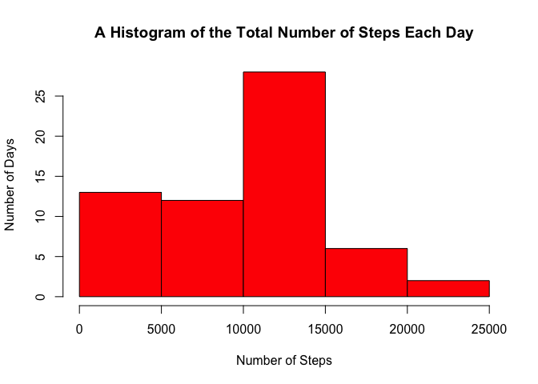
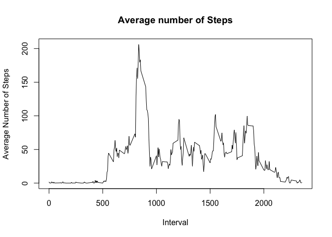
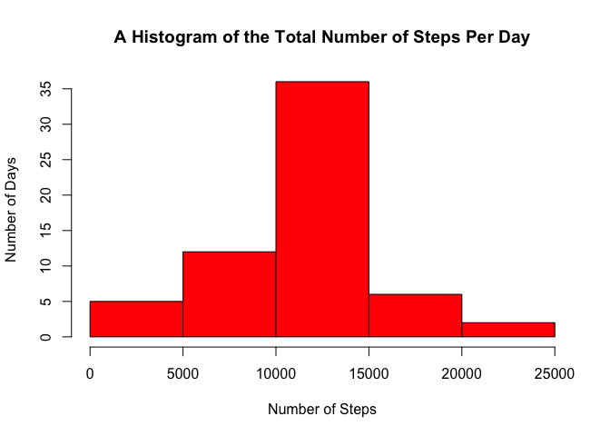
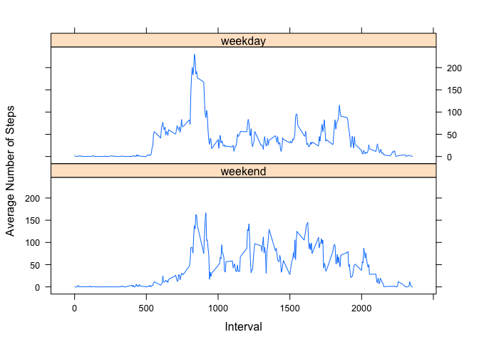

# Reproducible Research: Peer Assessment 1
------

------

## Loading and preprocessing the data
This section reads in the data stored in the activity.csv file. It assumes that the activity.csv file is in the current working directory.

```r
data <- read.csv('activity.csv')
```
------

## What is mean total number of steps taken per day?

The following code calculates the total number of steps taken each day, then finds the mean and median value.

```r
daily.steps <- tapply(data$steps,data$date,sum,na.rm=TRUE)
mean.daily.steps <- mean(daily.steps)
median.daily.steps <- median(daily.steps)
```
The mean value is: 

```r
print(mean.daily.steps)
```

```
## [1] 9354.23
```
and the median value is:

```r
print(median.daily.steps)
```

```
## [1] 10395
```

The following produces a histogram of the total number of steps each day.

```r
hist(daily.steps, main='A Histogram of the Total Number of Steps Each Day',xlab="Number of Steps",ylab='Number of Days',col='red')
```

 

------

## What is the average daily activity pattern?
The following code calculates the average number of steps at each 5-minute interval (ignoring na values).

```r
interval.average <- tapply(data$steps,data$interval,mean,na.rm=TRUE)
```

The following produces a plot of the average number of steps per interval.

```r
interval <- unique(data$interval)
plot(interval,interval.average,type='l',main='Average number of Steps',xlab='Interval',ylab='Average Number of Steps')
```

 

The following finds the interval which contains the largest average number of steps.

```r
max.interval <- interval[which(interval.average==max(interval.average))]
```

The interval with the largest average number of steps is:

```r
print(max.interval)
```

```
## [1] 835
```
------

## Imputing missing values
The following code finds and prints the number of missing values in the data.

```r
num.nas <- length(which(is.na(data$steps)))
print(num.nas)
```

```
## [1] 2304
```

The missing step values are populated with the average value from their corresponding 5-minute interval.

First, a temporary data frame is created which stores the interval and corresponding average for that interval (across all days). Then the temporary data frame is merged with the original data frame and the indicies which contain na's are populated with the corresponding interval average.

```r
temp_df <- data.frame(interval,interval.average)
merged.data <- merge(data,temp_df,by.x='interval',by.y='interval',all=TRUE)
indicies.of.na <- which(is.na(merged.data$steps))
merged.data$steps[indicies.of.na] <- merged.data$interval.average[indicies.of.na]
```

A new dataset is created from the merged dataset. The new dataset is equal to the original dataset, but missing data is filled in.

```r
new.data <- merged.data[names(data)]
```

A histogram of the total number of steps each day is made with the new dataset.

```r
daily.steps <- tapply(new.data$steps,new.data$date,sum)
hist(daily.steps, main='A Histogram of the Total Number of Steps Per Day',xlab="Number of Steps",ylab='Number of Days',col='red')
```

 

The mean and median of the new dataset is also calculated.

```r
filled.mean.daily.steps <- mean(daily.steps)
filled.median.daily.steps <- median(daily.steps)
```

Populating the missing data with the interval average has increased the mean and median value of total steps for each day!

The mean number of steps taken each day is now:

```r
print(filled.mean.daily.steps)
```

```
## [1] 10766.19
```

And the median number of steps taken each day is now:

```r
print(filled.median.daily.steps)
```

```
## [1] 10766.19
```
------

## Are there differences in activity patterns between weekdays and weekends?

The following code adds a factor variable to the dataset with two levels -- "weekday" and "weekend".

```r
day.of.week <- weekdays(as.Date(new.data$date))
weekend <- c('Saturday','Sunday')
new.data$WeekDay <- factor((day.of.week %in% weekend),levels=c(TRUE, FALSE), labels=c('weekend','weekday'))
```

The following chunk of code calculates the 5-minute interval average of number of steps taken averaged across all weekday days or weekend days.

```r
interval.average <- tapply(new.data$steps,list(new.data$interval,new.data$WeekDay),mean)
```

To get a nice lattice plot, similar to the README example, a new varible is added to the dataset which contains the weekday average if the row is a weekday or the weekend average if the row is a weekend.

First, a temporary data frame is created which contains the weekday and weekend average for each 5-minute interval. This data frame is melted, the variable names are made more appropraite, and then the data frame is merged with the new.data dataset.

```r
temp_df = data.frame(unique(new.data$interval),interval.average)
names(temp_df) <- c('interval','weekend','weekday')
library(reshape2)
temp_df <- melt(temp_df,id='interval')
colnames(temp_df)[which(names(temp_df) == 'variable')] <- "WeekDay"
colnames(temp_df)[which(names(temp_df) == 'value')] <- "level.average"
new.data <- merge(new.data,temp_df,all=TRUE,sort=FALSE)
```

The lattice plotting system is used to make a tiled plot showing the 5-minute interval average for the weekday days and weekend days.

```r
library(lattice)
xyplot(level.average ~ interval | WeekDay, data=new.data, layout = c(1,2), type='l',ylab='Average Number of Steps', xlab='Interval')
```

 

During the week, the average number of steps is larger at earlier intervals. However, weekends tend to have a higher average number of steps throughout the day. 
